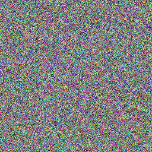
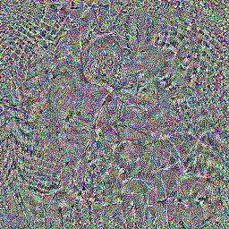

# manGANime

TJHSST Computer Systems Lab 2020--2021 project to generate anime from manga.
For more information, see the summary
[poster](https://stephen-huan.github.io/assets/pdfs/cs-lectures/machine-learning/syslab/poster.pdf),
view our
[presentation](https://docs.google.com/presentation/d/1VXtFrtPOzzfsVburlwUIgZQUSUBd-WVWtLnmeLQl_rA/edit?usp=sharing),
or read the full
[paper](https://stephen-huan.github.io/assets/pdfs/cs-lectures/machine-learning/syslab/paper.pdf).

## Getting Started

To get started, clone this repository and its submodules:
```bash
git clone --recursive https://github.com/stephen-huan/manGANime 
```
Install the dependencies with `conda`:
```bash
conda env create -f environment.yml
conda activate venv
```
or `pip`:
```bash
pip install -r requirements.txt
```

## Data Processing

See the
[scikit-image guide](https://scikit-image.org/docs/dev/user_guide/video.html)
on video processing. The library
[pims](https://soft-matter.github.io/pims/v0.5/index.html) is used for
most image sequence operations because of its many useful features
(e.g. automatic loading of many different file types, lazy loading).

### Useful `ffmpeg` Operations

Video to folder of images (1 FPS = extract 1 frame per second)
```bash
ffmpeg -i input.mp4 -ss 00:02:38 -t 00:23:42 -vf fps=1 image0-%05d.png
```

Images to video:
```bash
ffmpeg -framerate 1 -i image-%03d.png output.webm
```

[Resizing a video](https://trac.ffmpeg.org/wiki/Scaling):
```bash
ffmpeg -i input.mp4 -vf scale=256:256,setsar=1:1 output.mp4
```

### Preprocessing Script

The script `preprocess.py` provides many useful data manipulation functions.

Converting one video file format to another (in this case, from mkv to mp4): 
```bash
python preprocess.py reformat --format mp4 --path *.mkv     
```

Rename each file in a folder by assigning each
file a number according to their sorted order:
```bash
python preprocess.py index --path path/to/folder 
```

Preprocessing a manga folder (folder of *.png images):
```bash
python preprocess.py manga --path path/to/manga_folder 
```
The preprocessing steps include removing extraneous images from the folder,
and then applying greyscale, cropping, and resizing to each image. To control
which images are kept and the size of the crop, create a `config.json` file in
the manga folder. Assuming each file's name is a 0-indexed number resulting
from the aforementioned `index` function, `start` controls how many images to
skip from the beginning, `end` controls how many images to skip from the end,
`exclude` is a list of indexes to exclude, and `crop` controls the amount of
pixels to remove from each side of the image, ordered top, bottom, left, right.
An example `config.json` is below:
```json
{
    "start" : 3,
    "end": 4,
    "exclude": [20, 21, 39, 40, 56, 57, 74, 75, 91, 92],
    "crop": [62, 75, 64, 64]
}
```

Preprocessing an anime folder (folder of *.mp4 videos):
```bash
python preprocess.py anime --path path/to/preprocssed_anime_folder 
```
Configuration is not necessary for an anime folder since the preprocessing
is only re-sizing each video to 256x256 (the same as each manga page).

Excluding intros/outros from a video file:
```bash
python preprocess.py search --path path/to/anime_folder --type intro  
```
In order for the system to determine where the intros and outros are,
create a `config.json` file in the _preprocessed_ anime folder. Select a
representative image for the intro and the outro, and save them in the
same folder as `intro.png` and `outro.png`, respectively. The system then
searches each video file for an image closest to `intro.png` as measured
by a generalized cosine similarity in order to determine where the intro
occurs. Finally, the `left` and `right` parameters control many frames to
remove from the left and right of the representative image. For example,
if you select an image that occurs 10 seconds into the intro, and the
intro is 90 seconds long, you must remove 10 seconds from the left and 80
seconds from the right of the selected image. This is 10\*24 = 240 frames
left and 80\*24 = 1920 frames right. An example `config.json` is below:
```json
{
    "intro": {
        "image": "intro.png",
        "left": 1657,
        "right": 500
    },
    "outro": {
        "image": "outro.png",
        "left": 1866,
        "right": 10000
    }
}
```
Note that this script does not actually touch the video file and instead
stores an "exclude" parameter in the same `config.json`. `pims` can
then be used to slice the video file in order to remove the ranges.

### Labeling Data

Run the provided `tag.py` script to begin tagging
anime frames with their corresponding manga pages:
```bash
python label.py -c
```
The script expects a path to a video file for the anime
and a path to a folder of PNG images for the manga.

You can create a `config.json` file in the root
directory to automatically load these paths:
```json
{
    "anime_path": "preprocess/anime/glt/0.mp4",
    "manga_path": "preprocess/manga/glt/vol1"
}
```
If there is no config file, you can press the "anime_path" and
"manga_path" buttons in the upper left corner to pick the right path.

The script also expects a `config.json` file placed in the same folder as the
video file, generated by the aforementioned `search` function which excludes
frame ranges. Each video file should have the `exclude` parameter, which is a
list of pairs giving ranges to exclude, a `manga` parameter giving a path to
the corresponding manga volume (assuming both anime and manga are under the
root folder `preprocess/`) and the `pages` parameter, a range of manga pages
to consider. A sample `config.json` is below:
```json
{
    "0": {
        "exclude": [[0, 3850], [8702, 9548], [32170, 34094]],
        "manga": "glt/vol1",
        "pages": [0, 33]
    },
    "1": {
        ...
    },
    ...
    "intro": {
        ...
    },
    ...
}
```

Navigation can be done with the directional arrows (`<` and `>`), or by typing
a number into the boxes. The amount the arrows moves can be configured by
typing a number into the rightmost box ("1" by default). Pressing the `next
chunk` and `prev chunk` buttons jumps to the next scene change (as measured
by a large dissimilarity between adjacent frames). Finally, pressing the
`tag` button will pair the current anime frame to the current manga page and
save the result. Note that `tag` by design tags all untagged frames up to the
current frame, e.g. if the user is just starting to tag and does their first
tag at frame 100, the system will implicitly tag frames 0--100. Then, if the
user tags frame 250, the system will tag frames 100--250. This behavior is
from the monotonicity assumption discussed at length in the paper.

The script saves its annotations as a list of
name `filename.json`, e.g. `0.json` looks like:
```json
[200, 483, 1203, ..., 24478, 25350, 27471]
```

## [StyleGAN](https://github.com/NVlabs/stylegan2-ada) Integration 

To generate a dataset in the form StyleGAN expects, first generate a folder
of images from each video, like [`gen_dataset.sh`](./gen_dataset.sh). Then
run the following command (which is done automatically by `gen_dataset.sh`)
```bash
python stylegan2_ada_pytorch/dataset_tool.py --source path/to/image_folder --dest stylegan.zip
```

Then, to train StyleGAN, run the following command:
```bash
# lower batch size if out of memory
CUDA_VISIBLE_DEVICES=1 python stylegan2_ada_pytorch/train.py --outdir=train --gpus=1 --data=stylegan.zip --resume=ffhq256 --cfg=auto
```

Generating images:
```bash
python stylegan2_ada_pytorch/generate.py --outdir=out --network=network.pkl --trunc=1 --seeds=0-10
```

Projecting an image to the latent space:
```bash
python stylegan2_ada_pytorch/projector.py --outdir=out --network=network.pkl --target=input.png
```

### Our Functions

Projecting a video:
```bash
PYTHONPATH=/path/to/stylegan2_ada_pytorch/ python path.py project --network network.pkl --path input.mp4 
```

Re-training StyleGAN for future video prediction:
```bash
PYTHONPATH=... python train.py train --network network.pkl 
```

Testing the average mean-squared error of the resulting trained model:
```bash
PYTHONPATH=... python train.py test --network train/network.net
```

Generating video with the resulting trained model
(`manga.png` is an optional conditioning manga page):
```bash
PYTHONPATH=... python path.py generate --path input.mp4 --image manga.png --network network.net --frames 8 
```

## Backpropagation for Image Generation

We experimented with backpropagation for image generation. The idea
is the following: once StyleGAN is trained, we have a generator and a
discriminator. If the discriminator is an accurate parameterization of
the image manifold, then picking a random point and finding the closest
on-manifold point should theoretically randomly sample a point from the
discriminator's manifold, which exactly the goal of the generator (to
sample an image from the image distribution). We expected these images to
be higher quality since the algorithm is able to iteratively "improve"
the image, similar to how human artists create works while the standard
generator is a feed-forward network and hence a "one-shot" generator.
Unfortunately, we instead re-discovered adversarial attacks.

Specifically, our proposed algorithm is the following:
1. Initialize a random image, there are a variety of distributions: normal
distribution, uniform on [0, 255], etc. We choose to uniformly sample
each pixel from -1 to 1, the range expected by StyleGAN's discriminator.
2. Run the image through the discriminator to get a probability
3. Optimize the image by backpropagation on the objective `-log(D(X))`
4. Repeat steps 2--3 to iteratively move the image to a high probability image

Since StyleGAN's discriminator lacks a sigmoid layer, we apply sigmoid
and then log, so the objective is `-log(sigmoid(D(X)))`. Simple algebra
shows this is equivalent to `log(1 + e^(-D(x)))`, or `softplus(-D(x))`.

Our initial image on the left has a probability of 0.04 as measured by
the discriminator, as expected for a random image not belonging to the
image distribution. After 1000 iterations of backpropagation, the image
on the right evolves some "structure", but is still clearly mostly noise
to a human. However, the discriminator now thinks the image has a 0.959
probability of being real. Hence we have performed an adversarial attack
on the discriminator, by finding a small change in the starting image that
tricks the discriminator into changing its output.




These images were generated with the following command:
```bash
PYTHONPATH=... python backprop.py --network network.net 
```

